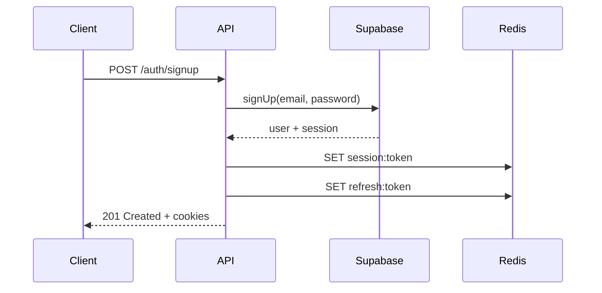
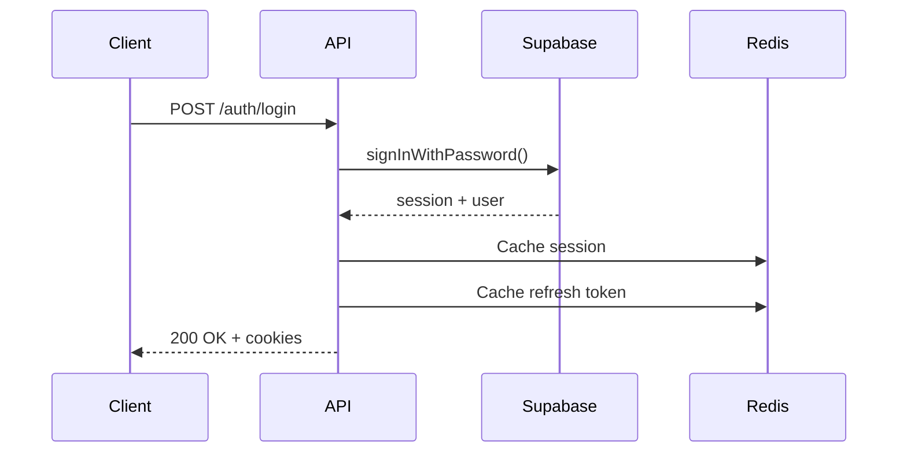
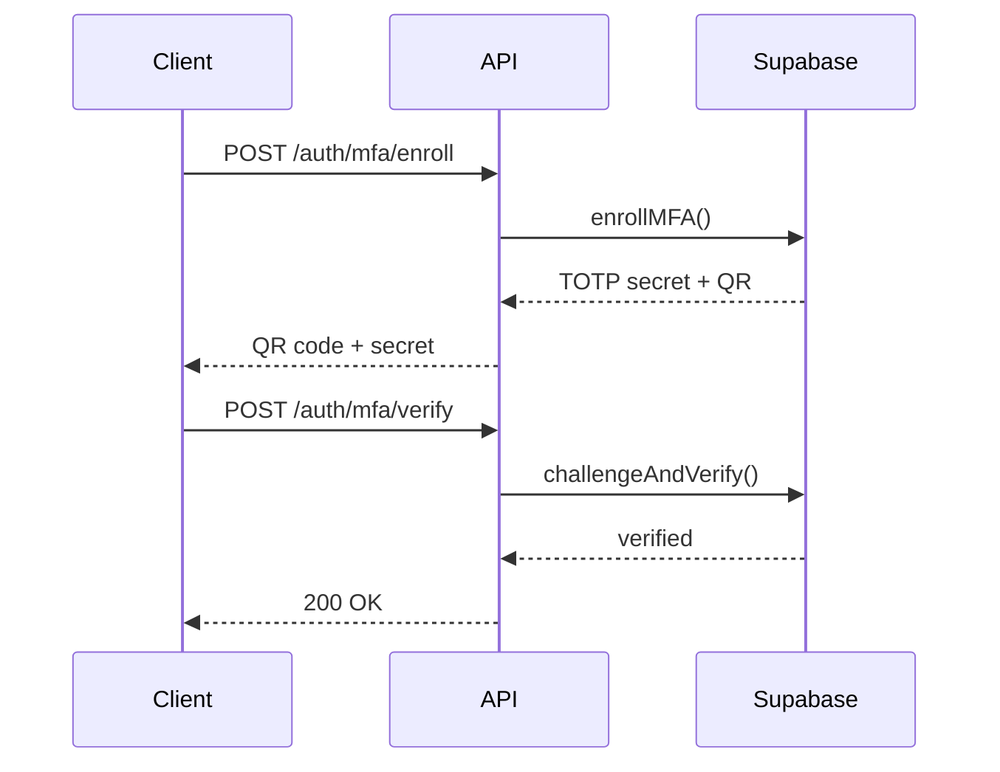

# 📚 Documentación Técnica - Mercador Backend

## 🎯 Resumen Ejecutivo

El backend de Mercador es una API REST moderna construida con **Hono.js** y **TypeScript**, diseñada para manejar operaciones de e-commerce de alta performance con autenticación robusta, cache inteligente y monitoreo completo.

## 🏗️ Arquitectura Técnica

### Patrón de Diseño
- **Clean Architecture**: Separación clara entre capas (routes, services, config)
- **Dependency Injection**: Inyección de dependencias para testabilidad
- **Repository Pattern**: Abstracción de acceso a datos
- **Middleware Pattern**: Procesamiento transversal de requests

### Capas de la Aplicación

#### 1. Routes Layer (Presentación)
```typescript
// routes/auth.ts
export const authRoutes = new OpenAPIHono()

authRoutes.openapi(loginRoute, async (c) => {
  const { email, password } = await c.req.valid('json')
  const result = await userService.loginWithEmail(email, password)
  return c.json({ success: true, data: result })
})
```

**Responsabilidades:**
- Validación de entrada con Zod
- Documentación OpenAPI automática
- Manejo de respuestas HTTP
- Middleware de autenticación

#### 2. Services Layer (Lógica de Negocio)
```typescript
// services/user.service.ts
export async function loginWithEmail(email: string, password: string) {
  const { data, error } = await supabase.auth.signInWithPassword({
    email, password
  })

  if (error) throw new Error(`Login failed: ${error.message}`)

  // Cache session in Redis
  await redisService.set(`session:${data.session.access_token}`,
    data.user.id, data.session.expires_in)

  return { user: data.user, session: data.session }
}
```

**Responsabilidades:**
- Lógica de negocio pura
- Validación de reglas de negocio
- Integración con servicios externos
- Manejo de transacciones

#### 3. Config Layer (Infraestructura)
```typescript
// config/redis.ts
export async function initRedis(logger: Logger) {
  const redisUrl = process.env.REDIS_URL
  const client = redisUrl.includes('upstash')
    ? new Redis({ url: redisUrl }) // Upstash REST
    : redis.createClient({ url: redisUrl }) // TCP

  client.on('error', (err) => logger.error({ err }, 'Redis error'))
  client.on('connect', () => logger.info('Redis connected'))

  return client
}
```

**Responsabilidades:**
- Configuración de conexiones externas
- Inicialización de clientes
- Manejo de credenciales
- Configuración de entornos

## 🔐 Sistema de Autenticación

### Flujo de Autenticación Completo

#### 1. Registro de Usuario


#### 2. Inicio de Sesión


#### 3. Verificación MFA


### Gestión de Sesiones

#### Cookies HTTP-Only
```typescript
// Configuración de cookies seguras
const sessionCookie = serialize('sb_access_token', accessToken, {
  httpOnly: true,
  secure: process.env.NODE_ENV === 'production',
  sameSite: 'lax',
  path: '/',
  maxAge: expiresIn
})
```

#### Cache de Sesiones en Redis
```typescript
// Almacenamiento con TTL
await redisService.set(
  `session:${accessToken}`,
  userId,
  expiresIn // TTL en segundos
)

// Validación de sesión
const userId = await redisService.get(`session:${token}`)
if (!userId) throw new Error('Invalid session')
```

## 🗄️ Gestión de Base de Datos

### Esquema de Base de Datos

#### Tabla `profiles`
```sql
CREATE TABLE profiles (
  id UUID PRIMARY KEY REFERENCES auth.users(id),
  email TEXT UNIQUE NOT NULL,
  full_name TEXT,
  role TEXT DEFAULT 'cliente',
  image TEXT,
  country TEXT,
  created_at TIMESTAMP DEFAULT NOW(),
  updated_at TIMESTAMP DEFAULT NOW()
);
```

#### Tabla `products`
```sql
CREATE TABLE products (
  id UUID PRIMARY KEY DEFAULT gen_random_uuid(),
  name TEXT NOT NULL,
  description TEXT,
  price DECIMAL(10,2) NOT NULL,
  category TEXT,
  image_url TEXT,
  stock INTEGER DEFAULT 0,
  created_at TIMESTAMP DEFAULT NOW(),
  updated_at TIMESTAMP DEFAULT NOW()
);
```

### Operaciones CRUD con Supabase

#### Lectura con Filtros y Paginación
```typescript
export async function listProducts(filters: ProductFilters) {
  const { page = 1, limit = 10, category, search } = filters

  let query = supabase
    .from('products')
    .select('*', { count: 'exact' })

  if (category) query = query.eq('category', category)
  if (search) query = query.ilike('name', `%${search}%`)

  const from = (page - 1) * limit
  const to = from + limit - 1
  query = query.range(from, to)

  const { data: products, error, count } = await query

  return {
    products: products || [],
    pagination: {
      page,
      limit,
      total: count || 0,
      totalPages: Math.ceil((count || 0) / limit)
    }
  }
}
```

## 🔄 Sistema de Cache

### Estrategias de Cache

#### 1. Cache de Sesiones
- **TTL**: Igual al tiempo de expiración del JWT
- **Key Pattern**: `session:{access_token}`
- **Uso**: Validación rápida de autenticación

#### 2. Cache de Productos
- **TTL**: 5-15 minutos
- **Key Pattern**: `products:{category}:{page}`
- **Uso**: Acelerar listados de productos

#### 3. Cache de Perfiles
- **TTL**: 30 minutos
- **Key Pattern**: `profile:{user_id}`
- **Uso**: Evitar consultas repetidas a BD

### Implementación de Cache
```typescript
// services/cache.service.ts
export class CacheService {
  async getOrSet<T>(
    key: string,
    ttl: number,
    fetcher: () => Promise<T>
  ): Promise<T> {
    const cached = await redisService.get(key)
    if (cached) return JSON.parse(cached)

    const data = await fetcher()
    await redisService.set(key, JSON.stringify(data), ttl)
    return data
  }
}
```

## 📊 Monitoreo y Observabilidad

### Métricas Prometheus

#### Métricas HTTP
```typescript
// config/metrics.ts
export const httpRequestDurationMs = new Histogram({
  name: 'http_request_duration_ms',
  help: 'Duration of HTTP requests in ms',
  labelNames: ['method', 'route', 'code'],
  buckets: [10, 50, 100, 250, 500, 1000, 2500, 5000]
})

export const httpRequestsTotal = new Counter({
  name: 'http_requests_total',
  help: 'Total number of HTTP requests',
  labelNames: ['method', 'route', 'code']
})
```

#### Health Checks
```typescript
// routes/health.ts
app.get('/health', async (c) => {
  const dbHealth = await checkDatabase()
  const redisHealth = await checkRedis()
  const overallHealth = dbHealth && redisHealth

  return c.json({
    status: overallHealth ? 'healthy' : 'unhealthy',
    timestamp: new Date().toISOString(),
    services: {
      database: dbHealth ? 'up' : 'down',
      redis: redisHealth ? 'up' : 'down'
    }
  }, overallHealth ? 200 : 503)
})
```

### Logging Estructurado

#### Configuración de Pino
```typescript
// config/logger.ts
export const logger = pino({
  level: process.env.LOG_LEVEL || 'info',
  formatters: {
    level: (label) => ({ level: label })
  },
  serializers: {
    err: pino.stdSerializers.err,
    req: pino.stdSerializers.req,
    res: pino.stdSerializers.res
  }
})
```

#### Uso en Middleware
```typescript
// middlewares/logger.ts
export const requestLogger = async (c, next) => {
  const start = Date.now()
  const { method, path } = c.req

  logger.info({ method, path }, 'Request started')

  await next()

  const duration = Date.now() - start
  const status = c.res.status

  logger.info({ method, path, status, duration }, 'Request completed')
}
```

## 🧪 Testing Strategy

### Tipos de Tests

#### 1. Unit Tests
```typescript
// services/user.service.test.ts
describe('loginWithEmail', () => {
  it('should login user successfully', async () => {
    const mockUser = { id: '123', email: 'test@example.com' }
    const mockSession = { access_token: 'token', refresh_token: 'refresh' }

    // Mock Supabase
    vi.mocked(supabase.auth.signInWithPassword).mockResolvedValue({
      data: { user: mockUser, session: mockSession },
      error: null
    })

    const result = await loginWithEmail('test@example.com', 'password')

    expect(result.user).toEqual(mockUser)
    expect(result.session).toEqual(mockSession)
  })
})
```

#### 2. Integration Tests
```typescript
// routes/auth.test.ts
describe('POST /auth/login', () => {
  it('should return 200 with valid credentials', async () => {
    const response = await request(app)
      .post('/auth/login')
      .send({ email: 'test@example.com', password: 'password' })
      .expect(200)

    expect(response.body.success).toBe(true)
    expect(response.body.data.session).toBeDefined()
  })
})
```

#### 3. E2E Tests
```typescript
// e2e/auth.spec.ts
test('complete login flow', async ({ page }) => {
  await page.goto('/login')
  await page.fill('[name=email]', 'test@example.com')
  await page.fill('[name=password]', 'password')
  await page.click('[type=submit]')

  await expect(page).toHaveURL('/dashboard')
})
```

## 🚀 Optimizaciones de Performance

### 1. Connection Pooling
```typescript
// config/database.ts
export const dbPool = new Pool({
  connectionString: process.env.DATABASE_URL,
  max: 20, // Máximo de conexiones
  idleTimeoutMillis: 30000,
  connectionTimeoutMillis: 2000,
})
```

### 2. Query Optimization
```typescript
// Índices en BD
CREATE INDEX idx_products_category ON products(category);
CREATE INDEX idx_products_price ON products(price);
CREATE INDEX idx_profiles_email ON profiles(email);

// Query optimizada
const { data } = await supabase
  .from('products')
  .select('id, name, price, category')
  .eq('category', category)
  .order('price', { ascending: true })
  .limit(limit)
```

### 3. Response Compression
```typescript
// middlewares/compression.ts
import { compress } from 'hono/compress'

app.use('*', compress())
```

## 🔒 Seguridad

### Headers de Seguridad
```typescript
// middlewares/security.ts
export const securityHeaders = async (c, next) => {
  c.header('X-Content-Type-Options', 'nosniff')
  c.header('X-Frame-Options', 'DENY')
  c.header('X-XSS-Protection', '1; mode=block')
  c.header('Referrer-Policy', 'strict-origin-when-cross-origin')
  c.header('Content-Security-Policy', "default-src 'self'")

  await next()
}
```

### Rate Limiting
```typescript
// middlewares/rate-limit.ts
const limiter = rateLimit({
  windowMs: 15 * 60 * 1000, // 15 minutes
  max: 100, // limit each IP to 100 requests per windowMs
  message: 'Too many requests from this IP, please try again later.'
})
```

### Input Validation
```typescript
// schemas/validation.ts
export const LoginSchema = z.object({
  email: z.string().email('Email inválido'),
  password: z.string()
    .min(8, 'Mínimo 8 caracteres')
    .regex(/^(?=.*[a-z])(?=.*[A-Z])(?=.*\d)/, 'Contraseña débil')
})
```

## 📈 Escalabilidad

### Estrategias Implementadas

#### 1. Horizontal Scaling
- **Stateless API**: No mantiene estado en memoria
- **External Sessions**: Redis para sesiones distribuídas
- **Database Sharding**: Particionamiento horizontal de BD

#### 2. Caching Strategy
- **Multi-layer Cache**: Memory → Redis → Database
- **Cache Invalidation**: Estrategias de invalidación inteligente
- **Cache Warming**: Precarga de datos populares

#### 3. Database Optimization
- **Read Replicas**: Separación de lecturas/escrituras
- **Connection Pooling**: Reutilización de conexiones
- **Query Optimization**: Índices y queries eficientes

### Métricas de Escalabilidad
```typescript
// Monitoring de performance
export const dbQueryDuration = new Histogram({
  name: 'db_query_duration_ms',
  help: 'Duration of database queries',
  labelNames: ['table', 'operation'],
})

export const cacheHitRatio = new Gauge({
  name: 'cache_hit_ratio',
  help: 'Cache hit ratio percentage',
})
```

## 🔧 Mantenimiento y Operaciones

### Tareas de Mantenimiento

#### 1. Limpieza de Sesiones Expiradas
```typescript
// scripts/cleanup-sessions.ts
export async function cleanupExpiredSessions() {
  const keys = await redisService.keys('session:*')
  for (const key of keys) {
    const ttl = await redisService.ttl(key)
    if (ttl === -2) { // Key doesn't exist
      await redisService.del(key)
    }
  }
}
```

#### 2. Backup de Base de Datos
```bash
# Script de backup
pg_dump $DATABASE_URL > backup_$(date +%Y%m%d_%H%M%S).sql
```

#### 3. Rotación de Logs
```typescript
// config/logger.ts
export const logger = pino({
  transport: {
    target: 'pino-rotating-file-stream',
    options: {
      path: './logs',
      period: '1d', // Rotar diariamente
      maxFiles: 30 // Mantener 30 días
    }
  }
})
```

### Monitoreo de Producción

#### Alertas Configuradas
- **Error Rate > 5%**: Alerta inmediata
- **Response Time > 2s**: Alerta de performance
- **Database Connections > 80%**: Alerta de capacidad
- **Memory Usage > 85%**: Alerta de recursos

#### Dashboards de Grafana
- **API Performance**: Latencia, throughput, error rates
- **Database Metrics**: Queries, connections, slow queries
- **System Resources**: CPU, memory, disk usage
- **Business Metrics**: Users, orders, revenue

## 📚 Referencias y Recursos

### Documentación Técnica
- [Hono.js Documentation](https://hono.dev/)
- [Supabase Documentation](https://supabase.com/docs)
- [Redis Documentation](https://redis.io/documentation)
- [Prometheus Documentation](https://prometheus.io/docs/)

### Guías de Mejores Prácticas
- [OWASP Security Guidelines](https://owasp.org/www-project-top-ten/)
- [REST API Design Best Practices](https://restfulapi.net/)
- [Database Performance Tuning](https://dev.mysql.com/doc/refman/8.0/en/optimization.html)

### Herramientas de Desarrollo
- [TypeScript Handbook](https://www.typescriptlang.org/docs/)
- [ESLint Rules](https://eslint.org/docs/rules/)
- [Prettier Configuration](https://prettier.io/docs/en/configuration.html)

---

**Esta documentación se mantiene actualizada con cada cambio significativo en la arquitectura del sistema.**
