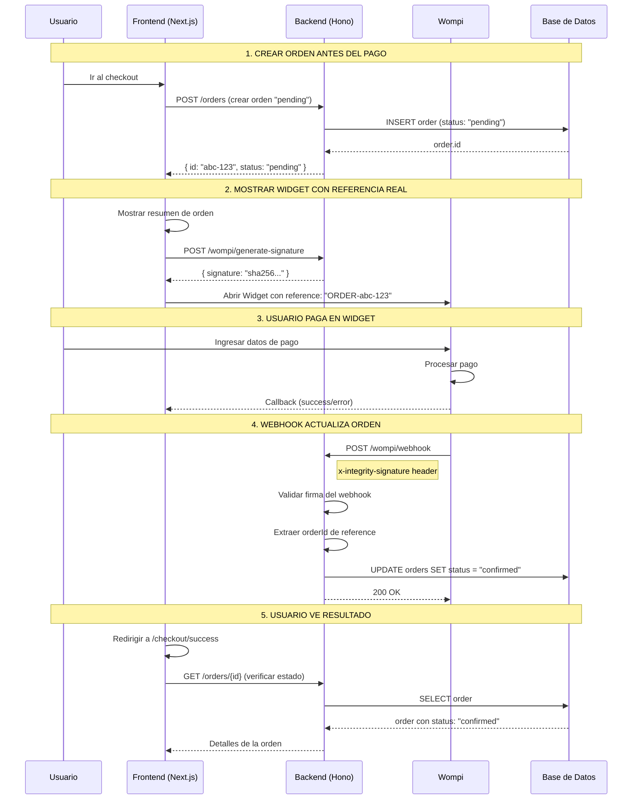

# 🚀 Flujo Completo de Wompi - Integración Actualizada

## 🎯 Problema Resuelto

**Antes:** El webhook de Wompi llegaba con una referencia, pero no había conexión con las órdenes reales en la base de datos.

**Ahora:** Flujo completo integrado donde las transacciones de Wompi actualizan automáticamente el estado de las órdenes.

---

## 🔄 Flujo Completo Actual



---

## 📁 Archivos Modificados

### Backend (`/leetcoding/src/`)

**`services/wompi.service.ts`**
- ✅ `generateIntegritySignature()`: Firma para Widget (reference + amount + currency + secret)
- ✅ `processWebhookEvent()`: Ahora conecta webhook con órdenes reales
- ✅ Extrae `orderId` de referencia `ORDER-{orderId}`
- ✅ Llama a `updateOrderStatusWithPayment()`

**`routes/wompi.ts`**
- ✅ Webhook ahora valida header `x-integrity-signature`
- ✅ Mejor logging de eventos

**`services/order.service.ts`**
- ✅ `updateOrderStatusWithPayment()`: Actualiza orden + registra payment_id

### Frontend (`/codeforces/src/`)

**`app/checkout/page.tsx`**
- ✅ Crea orden "pending" al cargar la página
- ✅ Usa `order.id` real en referencia: `ORDER-${order.id}`
- ✅ Redirige a success/failure con parámetros

**`components/payment/WompiCheckout.tsx`**
- ✅ Sin cambios - funciona igual

**`app/checkout/success/page.tsx`** *(Nuevo)*
- ✅ Página de confirmación con detalles de orden
- ✅ Muestra ID de transacción y estado

**`app/checkout/failure/page.tsx`** *(Nuevo)*
- ✅ Página de error con posibles causas
- ✅ Opción de reintentar pago

---

## 🔧 Configuración Requerida

### 1. Variables de Entorno
```bash
# Backend (.env)
WOMPI_PUBLIC_KEY=pub_test_Tw2jqAg8Czap2VTFWYPoJkrvTgqK8NFi
WOMPI_PRIVATE_KEY=prv_test_BeGrXTSwTSRCFOnyTY8BErur5V4jqTQT
WOMPI_EVENTS_SECRET=test_integrity_da6xTSFwIjmkBcbaEajluAEHar7jvewT
WOMPI_API_URL=https://sandbox.wompi.co/v1

# Frontend (.env.local)
NEXT_PUBLIC_API_URL=http://localhost:3010
```

### 2. Webhook URL en Panel de Wompi
```
https://tu-dominio.com/api/wompi/webhook
```
Para desarrollo local usar ngrok:
```bash
ngrok http 3010
# URL: https://abc123.ngrok.io/api/wompi/webhook
```

### 3. Base de Datos
Tabla `orders` debe existir con campos:
- `id` (UUID, primary key)
- `user_id` (UUID, foreign key)
- `status` (enum: pending, confirmed, shipped, delivered, cancelled)
- `total_amount` (numeric)
- `shipping_address` (jsonb)
- `payment_method` (string)
- `created_at`, `updated_at` (timestamps)

---

## 🧪 Testing

### Script de Prueba Completo
```bash
cd /home/amador/gh/leetcoding
node test-complete-flow.js
```

### Tarjetas de Prueba (Sandbox)
- **Aprobada:** `4242424242424242`
- **Rechazada:** `4111111111111111`
- **CVV:** `123`
- **Fecha:** Cualquier fecha futura

### Verificar en Base de Datos
```sql
-- Después de un pago exitoso
SELECT id, status, total_amount, updated_at
FROM orders
WHERE id = 'abc-123';
-- Resultado esperado: status = 'confirmed'
```

---

## 🔍 Debugging

### Logs Importantes

**Backend - Creación de orden:**
```
🛒 Creando orden antes del pago...
✅ Orden creada: { id: "abc-123", status: "pending" }
```

**Backend - Firma generada:**
```
🔐 Firma de integridad (Widget) generada para: {
  reference: "ORDER-abc-123",
  amountInCents: 10400000,
  currency: "COP",
  type: "WIDGET_EMBED"
}
```

**Backend - Webhook recibido:**
```
📬 Webhook de Wompi recibido: {
  event: "transaction.updated",
  transactionId: "wompi-xyz-123",
  status: "APPROVED",
  reference: "ORDER-abc-123"
}
🔗 Conectando webhook con orden: abc-123
✅ Pago aprobado para orden: abc-123
```

### Posibles Errores

**Error: "Invalid reference format"**
- La referencia no tiene formato `ORDER-{uuid}`
- Verificar que se esté usando `ORDER-${order.id}`

**Error: "Order not found"**
- La orden no existe en la DB
- Verificar que se creó antes del pago

**Error: "Invalid webhook signature"**
- Firma del webhook no coincide
- Verificar `WOMPI_EVENTS_SECRET` en `.env`

---

## 📊 Estados de Orden

| Estado Wompi | Estado Orden | Descripción |
|-------------|--------------|-------------|
| `PENDING` | `pending` | Pago en proceso |
| `APPROVED` | `confirmed` | Pago exitoso |
| `DECLINED` | `cancelled` | Pago rechazado |
| `VOIDED` | `cancelled` | Pago anulado |
| `ERROR` | `cancelled` | Error en pago |

---

## 🚀 Próximos Pasos

1. **Configurar webhook URL** en panel de Wompi
2. **Probar flujo completo** con tarjeta de prueba
3. **Implementar notificaciones** por email al cambiar estado
4. **Agregar manejo de inventario** cuando se confirma pago
5. **Configurar reintentos** para pagos fallidos

---

## 📞 Soporte

Si hay problemas:
1. Revisar logs del backend
2. Verificar configuración de webhook en Wompi
3. Probar con script `test-complete-flow.js`
4. Verificar estado de órdenes en base de datos

¡El flujo ahora está completamente integrado! 🎉